# 🏛️ SalesPilot AI — System Architecture & Technical Design

This document details the high-level architecture, module design, data flow, component patterns, and database schemas of **SalesPilot AI**.

---

## 1. High-Level Architecture Overview

SalesPilot AI follows a decoupled, single-page application (SPA) architecture backed by a RESTful Django service layer.

```text
┌──────────────────────────────────────────────────────────────────────────┐
│                         PRESENTATION LAYER                               │
│                         (React 18 + Vite SPA)                            │
│                                                                          │
│  ┌──────────────┐   ┌──────────────┐   ┌──────────────┐  ┌────────────┐  │
│  │ Sales        │   │ Campaign     │   │ ICP          │  │ Lead       │  │
│  │ Intelligence │   │ Management   │   │ Generator    │  │ Discovery  │  │
│  └──────────────┘   └──────────────┘   └──────────────┘  └────────────┘  │
│  ┌──────────────┐   ┌──────────────┐   ┌──────────────┐                  │
│  │ Email        │   │ Analytics    │   │ User Profile │                  │
│  │ Drafts       │   │ Dashboard    │   │ Navigation   │                  │
│  └──────────────┘   └──────────────┘   └──────────────┘                  │
└────────────────────────────────────┬─────────────────────────────────────┘
                                     │ HTTP / REST (Axios)
                                     ▼
┌──────────────────────────────────────────────────────────────────────────┐
│                           API GATEWAY / DRF                              │
│                      (Django REST Framework)                             │
│                                                                          │
│  ┌───────────────────┐  ┌──────────────────┐  ┌───────────────────────┐ │
│  │ CORS Middleware   │  │ Serializers      │  │ Request Interceptors  │ │
│  └───────────────────┘  └──────────────────┘  └───────────────────────┘ │
└────────────────────────────────────┬─────────────────────────────────────┘
                                     │
                                     ▼
┌──────────────────────────────────────────────────────────────────────────┐
│                         BUSINESS SERVICE LAYER                           │
│                                                                          │
│  ┌───────────────────┐  ┌──────────────────┐  ┌───────────────────────┐ │
│  │ DashboardService  │  │ LeadGenerator    │  │ EmailGenerator        │ │
│  └───────────────────┘  └──────────────────┘  └───────────────────────┘ │
└────────────────────────────────────┬─────────────────────────────────────┘
                                     │ Django ORM
                                     ▼
┌──────────────────────────────────────────────────────────────────────────┐
│                          DATA & STORAGE LAYER                            │
│                        (SQLite / PostgreSQL)                             │
│                                                                          │
│    [Campaign] ───────< [ICP]     [Lead] ───────< [EmailDraft]            │
│         │                          ▲                                     │
│         └──────────────────────────┘                                     │
└──────────────────────────────────────────────────────────────────────────┘
```

---

## 2. Component Layer Responsibilities

### 2.1 Presentation Layer (Frontend)
- **Framework**: Vite + React 18 SPA.
- **Routing**: `react-router-dom` with a `ProtectedLayout` shell containing the collapsible `Sidebar` and sticky `Navbar`.
- **UI Design System**: Material UI (MUI v5) styled with custom dark-mode tokens (`#0B1020` background, `#111827` glass card containers, `backdropFilter: blur(16px)`).
- **Animations**: `framer-motion` variant orchestration for staggered page entry, count-up numbers, card elevation transitions, and live status pulses.
- **Charts**: `recharts` responsive containers for Bar Charts, Area Charts, Line Charts, Donut Pie Charts, and inline KPI sparklines.
- **Service Abstraction**: Modular API services in `src/services/` (`api.js`, `dashboardService.js`, `campaignService.js`, `icpService.js`, `leadService.js`, `emailDraftService.js`, `analyticsService.js`).

### 2.2 API & Serialization Layer (Backend)
- **Framework**: Django REST Framework (`APIView` and `ModelViewSet` classes).
- **CORS Handling**: `django-cors-headers` explicitly whitelisting frontend ports (`http://localhost:3000`, `http://localhost:5173`, `http://127.0.0.1:3000`).
- **Serializers**: Strict validation serializers (`CampaignSerializer`, `ICPSerializer`, `LeadSerializer`, `EmailDraftSerializer`, `GenerateEmailSerializer`, `DashboardStatsSerializer`).

### 2.3 Business Service Layer
- **`DashboardService`**: Calculates system-wide metrics and per-campaign statistics using single-query ORM aggregations (`Count`, `Q` filters) to prevent N+1 query overhead.
- **`LeadGenerator`**: Matches target campaign ICP rules against prospect databases, preventing duplicate lead insertions (`contact_email` uniqueness).
- **`EmailGenerator`**: Crafts personalized outreach copy based on selected tones (`Professional`, `Friendly`, `Casual`, `Formal`), parsing subject headers and email bodies.

---

## 3. Database Schema & Entities

```mermaid
erDiagram
    CAMPAIGN ||--o{ ICP : defines
    CAMPAIGN ||--o{ LEAD : targets
    LEAD ||--o{ EMAIL_DRAFT : generates

    CAMPAIGN {
        int id PK
        string name
        string description
        string status "ACTIVE | INACTIVE | DRAFT"
        datetime created_at
        datetime updated_at
    }

    ICP {
        int id PK
        int campaign_id FK
        string industry
        string company_size
        string location
        string job_title
        text pain_points
        text keywords
        text technologies
        datetime created_at
    }

    LEAD {
        int id PK
        int campaign_id FK
        string company_name
        string contact_name
        string contact_email
        string industry
        string country
        string status "NEW | QUALIFIED | CONTACTED | EMAIL_SENT | REPLIED | REJECTED"
        datetime created_at
    }

    EMAIL_DRAFT {
        int id PK
        int lead_id FK
        string subject
        text body
        string tone "Professional | Friendly | Casual | Formal"
        string status "DRAFT | APPROVED | REJECTED | SENT"
        datetime created_at
        datetime updated_at
    }
```



---

## 4. Key Data Flows

### 4.1 Lead Generation Flow
1. User selects a Campaign in the **Lead Discovery** module and clicks **Generate Leads**.
2. Frontend sends `POST /api/leads/generate/` with `{ campaign_id }`.
3. Backend fetches the campaign's linked **ICP rules** (`industry`, `company_size`, `job_title`).
4. Engine queries prospect sources, filters matching profiles, skips duplicate emails, and bulk-inserts new `Lead` records.
5. Backend responds with `{ generated_count, skipped_duplicates, message }`.
6. Frontend updates lead data table and triggers toast notification.

### 4.2 AI Email Generation & Approval Workflow
1. User selects a Lead and desired Tone in the **Email Drafts** module and clicks **Generate**.
2. Frontend sends `POST /api/email-drafts/generate/` with `{ lead_id, tone }`.
3. AI Engine formats prompt incorporating lead contact name, company, industry, and tone rules.
4. Engine generates `subject` and `body`, saving a new `EmailDraft` record with status `DRAFT`.
5. Human Review Workflow:
   - **Approve**: `POST /api/email-drafts/{id}/approve/` -> status transitions to `APPROVED`.
   - **Reject**: `POST /api/email-drafts/{id}/reject/` -> status transitions to `REJECTED`.
   - **Send**: `POST /api/email-drafts/{id}/send/` -> status transitions to `SENT` and lead status updates to `EMAIL_SENT`.

---

## 5. Performance & Optimization Strategy

1. **ORM Query Optimization**: Single annotated ORM queries in `DashboardService` (`Count('leads__email_drafts', filter=Q(...), distinct=True)`) to eliminate N+1 database queries.
2. **Case-Insensitive Status Normalization**: Frontend normalizes status strings (`toLowerCase()`) to handle casing differences between backend choices (`"APPROVED"`) and UI filters (`"approved"`).
3. **Axios Timeout & Error Boundary**: 15-second request timeouts with interceptors handling standard HTTP errors (401, 403, 500) gracefully with UI error alerts and retry buttons.
4. **Vite Code Splitting & Caching**: Fast HMR during development and optimized bundle chunking for production builds.

---

## 6. Security Design
- **CORS Restricted Whitelist**: Production origins configured in `settings.py`.
- **Input Validation**: DRF serializers validate required fields, email formats, and foreign key constraints before execution.
- **Stateless Auth Ready**: `api.js` interceptor pre-configured to attach `Bearer <token>` from `localStorage` for seamless JWT integration.
